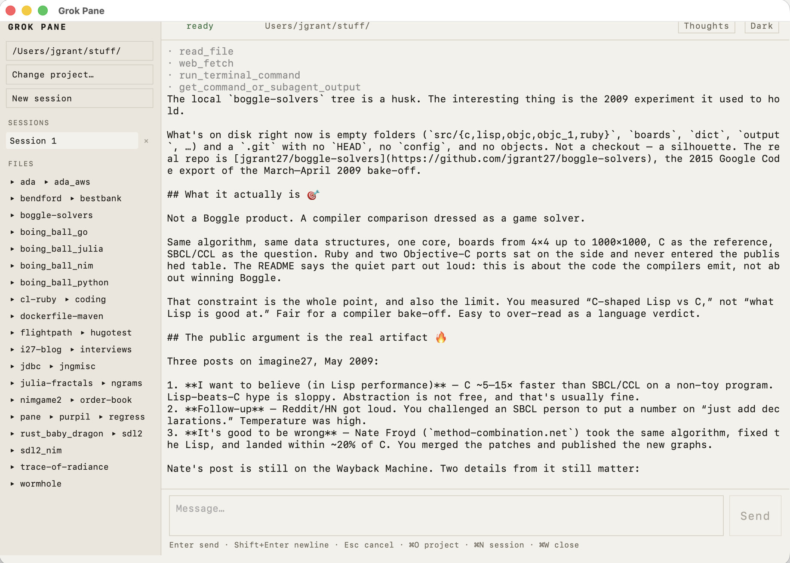

<p align="center">
  
</p>

# Grok Pane

A desktop window onto [`grok agent serve`](https://grok.com). The agent runs on **this machine**. Grok Pane is a face, not a second computer.

Two programs:

| | |
| --- | --- |
| **`pane`** | Local server. Starts Grok’s agent if needed, proxies the session, serves the UI. |
| **Grok Pane** | Native desktop app. Talks to `pane`. Sessions, history, transcript. |

Light theme is the default.



---

## 1. What you need

- **Go 1.25+** — https://go.dev/dl
- **Grok CLI**, signed in
- On a Mac, **Xcode command-line tools** (`xcode-select --install`) so the desktop app can link WebKit

Install Grok:

```bash
curl -fsSL https://x.ai/cli/install.sh | bash
```

Windows (PowerShell):

```powershell
irm https://x.ai/cli/install.ps1 | iex
```

Sign in once (opens a browser):

```bash
grok
```

or `grok login`. After that, credentials live in `~/.grok/auth.json`.

Check:

```bash
grok --version
```

---

## 2. Get Grok Pane

```bash
git clone https://github.com/jgrant27/pane
cd pane
```

---

## 3. Build and open the desktop app

**macOS** (recommended):

```bash
make desktop-app
open "Grok Pane.app"
```

That builds the `pane` server, the `grok-pane` window, and wraps them as **Grok Pane.app**. The first time, macOS may ask you to allow an unsigned app: System Settings → Privacy & Security → Open Anyway.

**macOS / Linux / Windows** (raw binary):

```bash
make desktop
./grok-pane          # Windows: grok-pane.exe
```

On Linux you also need GTK + WebKit (`libgtk-3-dev` and `libwebkit2gtk-4.1-dev` on Debian/Ubuntu). On Windows, install [WebView2](https://developer.microsoft.com/microsoft-edge/webview2/) if the app will not start.

### Linux via Docker / QEMU (amd64 and arm64)

Needs Docker running (Buildx). `make desktop-linux` installs QEMU binfmt itself, then builds both architectures:

```bash
make desktop-linux           # dist/linux-amd64 and dist/linux-arm64
make desktop-linux-amd64
make desktop-linux-arm64
```

Windows WebView apps cannot be built that way (no licensed Windows image in the repo). Build on a Windows box, or take the GitHub Actions artifacts.

### GitHub Actions

Pushes and PRs to `main` run `.github/workflows/build.yml`. Each job uploads a `grok-pane-<os>-<arch>` artifact (`pane` + `grok-pane`; macOS also packs `Grok-Pane.app.zip`).

| Artifact | Runner |
| --- | --- |
| `darwin-arm64` | macos-14 |
| `linux-amd64` / `linux-arm64` | ubuntu-24.04 / ubuntu-24.04-arm |
| `windows-amd64` / `windows-arm64` | windows-latest / windows-11-arm |
| QEMU Linux amd64 + arm64 | ubuntu-24.04 + `docker/setup-qemu-action` |

Push a `v*` tag to publish those zips plus `SHA256SUMS` on a GitHub Release:

```bash
git tag v0.1.0
git push origin v0.1.0
```

Linux desktop builds use Wails’ `webkit2_41` tag (Ubuntu 24.04 has WebKit 4.1, not 4.0). Windows ARM is `continue-on-error` if that runner is missing. Intel Macs are not in CI — build locally with `make desktop-app`.

---

## 4. Use it

The app looks for `pane` on `http://127.0.0.1:7420`. If nothing is listening, it starts `pane` for you. `pane` starts `grok agent serve` on `:2419` if that port is free.

1. **Open a project** — File → Open Project (⌘O / Ctrl+O), or the **Open project** button. After a folder is chosen, the left rail shows its name. Click the name to show the folder in Finder / Explorer / your file manager. Open Project again to switch trees.
2. **Talk** — type in the box at the bottom. **Enter** sends, **Shift+Enter** is a newline, **Esc** cancels the turn. While Grok is working, Enter **queues** a follow-up.
3. **New session** — File → New Session (⌘N / Ctrl+N), or the button. Each session is its own chat against the current (or another) folder. **History** lists Grok’s saved sessions for this folder; click one to resume it (transcript + context).
4. **Delete a session** — the **×** on a session or history row, then confirm. That wipes it from Grok’s on-disk history. **⌘W** / File → Close Session only closes the tab.
5. **Thoughts** — off by default. Click **Thoughts** so it reads **Thoughts on**; the current turn’s reasoning appears above the reply. Click again to hide it.
6. Replies render as markdown (headings, lists, tables, code).
7. **Theme** — light by default; **Dark** in the header.

Leave the app running. Quit with ⌘Q / Alt+F4, or close the window.

---

## 5. If it does not connect

| Symptom | What to do |
| --- | --- |
| Status stuck on `connecting…` / `disconnected` | Is anything else bound to **7420**? In a terminal: `./pane -no-open` then reopen Grok Pane. |
| `pane server is not running and no pane binary was found` | Run `make` in this repo, then either `make install` (puts `pane` on `~/.local/bin`) or start `./pane` yourself before the app. |
| Agent errors / auth | `grok login`, then retry. |
| Mac: app won’t open | Unsigned build. System Settings → Privacy & Security → Open Anyway. Or run `./grok-pane` from the repo. |

The server writes a secret to `~/.grok/pane.secret` on first run (or uses `-secret` / `$GROK_AGENT_SECRET` / `$PANE_SECRET`). You do not normally need to touch this.

---

## Browser only (no desktop app)

```bash
make
./pane
./pane -cwd ~/src/my-project
```

Opens http://127.0.0.1:7420 — same UI. Ctrl-C stops `pane` and any agent **it** started. An agent that was already running is left alone.

```bash
make install              # ~/.local/bin/pane
make run ARGS='-cwd .'
```

---

## Tailscale

```bash
./pane -tailscale
```

Puts `tailscale serve` in front and requires `Tailscale-User-Login`. Hits straight to `:7420` get 403.

**Do not use `tailscale funnel`.** That publishes the page — and the agent — to the public internet.

---

## What it is (and is not)

- Auto-approves tool permission prompts (`yoloMode`). Treat it like a local shell with a window attached.
- Parallel sessions, each with its own cwd.
- Not a clone of Claude’s diff viewer, in-app browser, or git-isolated worktrees. The agent already does the coding.

---

## Flags (`pane`)

| Flag | Default | |
| --- | --- | --- |
| `-listen` | `127.0.0.1:7420` | HTTP |
| `-agent` | `ws://127.0.0.1:2419` | `grok agent serve` base |
| `-agent-bind` | `127.0.0.1:2419` | where to start the agent |
| `-secret` | env / `~/.grok/pane.secret` | `server-key` |
| `-cwd` | `$HOME` | default ACP working directory |
| `-tailscale` | false | `tailscale serve` + identity gate |
| `-no-agent` | false | do not start the agent |
| `-no-open` | false | do not open a browser |

---

## Layout

```
pane/
  main.go          server CLI, HTTP, agent, Tailscale
  proxy.go         browser WS ↔ ACP (cwd per connection)
  history.go       GET/DELETE /v1/sessions, transcript replay
  web/             UI (browser and desktop)
  desktop/         Grok Pane (Wails)
```

## License

MIT. xterm.js in `web/vendor/` is MIT. marked is MIT. DOMPurify is Apache-2.0 / MPL-2.0. Wails is MIT.
